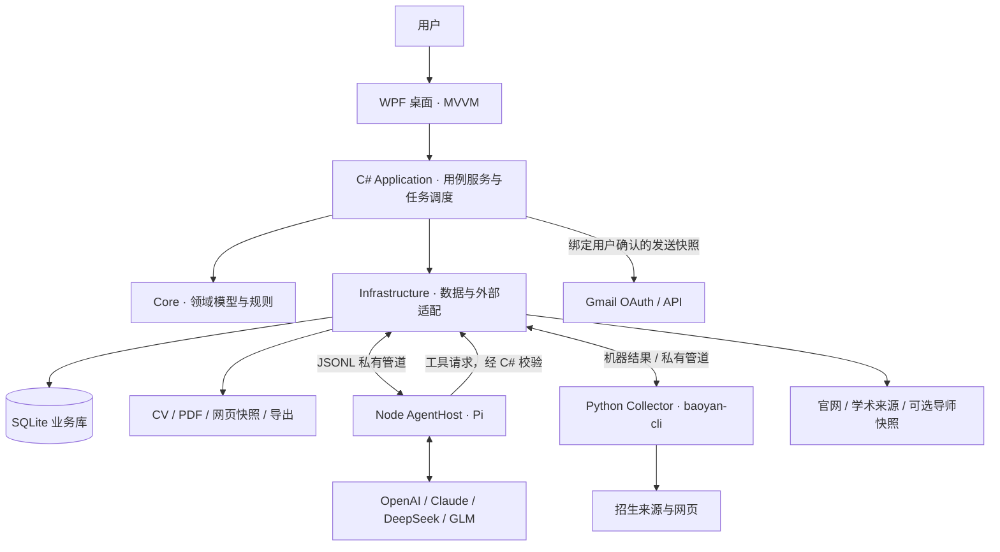

# 概要设计

基准日：2026-09-05。产品选择见[主索引](README.md)，字段与接口见[详细设计](02-detailed-design.md)。

## 1. 目标与系统边界

Tools Touch 帮助用户完成“确认个人背景→发现学校／学院机会→判断时间窗口→比较学院→筛选导师→研究方向与论文→撰写联系邮件→确认发送→记录申请进展”。

Pi 是模型认证与智能分析执行依赖，不承担产品用户体系、业务数据库或邮件发送决策。Google OAuth 是 Gmail 授权机制；本地产品首版沿用 Gmail 登录入口，不另建云端注册服务器。baoyan-cli 提供招生信息线索，学校官网提供可核实的官方信息。二者不等同于全国完整招生数据库。

| 外部实体 | 输入／输出 | 应用内责任方 |
| --- | --- | --- |
| 用户 | CV、背景、需求、校正、发送确认、申请进展 | WPF＋Application |
| Pi 与模型 provider | 授权交互、模型列表、工具调用、结构化研究结果 | AgentHost＋AgentBridge |
| Google OAuth／Gmail | 授权、邮件发送回执、已发送核对、回复线程 | GmailAuth／GmailService |
| baoyan-cli | 学校、学院、公告年份、报名时间、官网／投递链接 | BaoyanAdapter |
| 学校官网／导师主页／学术来源／经验资料 | 师资、招生、论文、背景样本与评价 | Collection／Evidence |
| 飞跃导师参考库 | 可选的已有导师数据种子 | SupervisorSnapshotImporter |

应用管理报名链接与投递记录。学校系统中的自动填表、提交申请或自动群发邮件不属于首版设计；用户在官网完成投递后可登记回执。

## 2. 已有代码及扩展缺口

以下是对本地文件的检查结果，不等同于重新运行验收。

| 当前能力 | 代码依据 | 目标变化 |
| --- | --- | --- |
| 六页 WPF 与账号设置 | `src/ToolsTouch.Desktop/` | 按学校、学院、推荐、投递拆分视图及 ViewModel |
| SQLite 和三次迁移 | `src/ToolsTouch.Core/Migrations/001—003` | 新增院校、轮次、声明证据、批次采集和推荐快照 |
| Pi 0.85.0 子进程与 provider 登录 | `agent-host/src/`、`AgentBridge.cs` | 版本化契约、任务级工具集合、批量任务调度 |
| Discover／Analyze／Draft 阶段恢复 | `DiscoveryService.cs` | 细化到学院／导师子任务，保存成本与覆盖率 |
| 网页、arXiv、Crossref、PDF 读取 | `PublicWeb.cs`、`SearchServices.cs`、`LibraryService.cs` | 多来源适配、不可变来源版本、论文阅读范围 |
| 草稿、人工发送、Unknown 核对、回复同步 | `OutreachService.cs`、`GmailService.cs` | 独立发送尝试、确认记录、学校申请状态 |
| CV 确认版本 | `LibraryService.cs`、`UserProfile` | 排名、语言、论文等结构化字段和需求版本 |
| 独立 baoyan-cli | `baoyan-cli/baoyan.py` | 机器协议、原始数据保留、C# 导入与时间状态 |
| npm 锁文件、Python 脚本 | `agent-host/package-lock.json`、`scripts/` | 按用户要求迁移至 pnpm／uv，含打包与 CI |

既有 `Professor.Institution` 是字符串，不能表达多个任职关系；`SourceDocument` 以 URL 为主键，不能完整保留同网址多次变化；现有 Discover 提示目标约五位导师，不能当作学院全量名单采集。上述三处是扩展优先级最高的数据与流程缺口。

## 3. 推荐架构

采用本地模块化单体：业务由一个 C# 应用进程统一管理，Node 与 Python 作为受控子进程。模块在代码层隔离；首版不引入常驻 Web 后端、消息中间件或远程向量数据库。

选型理由：现有代码已经采用 C#→Pi 子进程；沿用可减少重写。C# 集中掌握数据库事务和人工确认，Pi 的工具调用变成可校验的业务请求。Python 只承担已有 CLI、浏览器采集与格式适配，避免引入第二套用户／推荐／邮件业务系统。

## 4. 模块划分

| 模块 | 职责 | 持久化输出 |
| --- | --- | --- |
| Accounts | Gmail 授权，Pi 能力、模型选择及连接状态 | 账号元数据、凭据引用 |
| Profiles | CV 导入、事实校正、背景与需求版本 | ProfileRevision、PreferenceRevision |
| Admissions | 学校／学院／项目目录、公告、年度、时间窗口 | AdmissionRound、WindowObservation |
| Collection | 来源采集、目录遍历、去重、更新与覆盖报告 | CrawlBatch、SourceSnapshot、EvidenceClaim |
| Faculty | 导师身份、任职、方向、招生、评价、论文关联 | Professor、Appointment、RecruitmentClaim |
| Research | Pi 网页研究、论文阅读、结构化分析 | AnalysisArtifact、PaperReadSegment |
| Recommendation | 学院资格与背景适配；导师匹配及重排 | RecommendationRun／Item |
| Outreach | 草稿、修订、用户确认、发送、核对与回复 | Outreach、SendAttempt、EmailThread |
| Tracking | 官网申请、联系进展、提醒、备注、材料清单 | ApplicationCase、ApplicationEvent |
| Workspace | 自定义表／字段、关联、保存视图、批量编辑、全量导出、备份 | Collection、RecordRef、FieldValue、ViewDefinition、备份清单 |

学院推荐和导师推荐共用证据及用户画像，但目标不同：学院推荐考虑项目资格、背景匹配和窗口；导师推荐考虑方向、技能、培养需求和当年招生证据。学院适合不自动推出所有导师适合。

## 5. 四条主要数据流

1. **招生机会**：baoyan／官网→原始记录→学校／学院实体匹配→活动年度校验→本年实际状态与历史预测分别计算→学校总览及学院表。
2. **导师信息**：学院师资目录→完整遍历与覆盖记录→主页／招生／论文／评价采集→证据声明与实体合并→可检索导师库。
3. **个性化推荐**：确认的 CV＋需求版本→结构化事实→规则资格检查→全体候选粗排→限额语义分析／重点论文阅读→带分项和证据的排名快照。
4. **联系与投递**：选中导师／分析→Pi 草稿→用户编辑和确认→C# 固定发送内容→Gmail→发送回执／Unknown 核对→联系记录与人工登记的官网申请。

## 6. 必须保持的规则

- 今年没有公告时，历史窗口只提供“预计未开始／预计窗口内／预计区间已过、待确认”；只有本年可信事实才决定本年实际结束。
- 每个学校拥有 UI 视图或 Excel 工作表；数据库只建统一 School／Department 等表，不按学校生成物理表。用户自定义表使用通用记录与字段元数据，并关联学校／导师／申请等内置记录。
- 公开事实、第三方经验、用户备注、模型推断分别记录；未知不当作否、零分或零篇。
- 招生状态绑定年度、学位类型与任职范围；旧年份“招生”不沿用到新年份。
- 模型无法直接发送邮件、读取 Gmail 凭据或任意写数据库。网页正文只作为资料输入。
- 本地数据库与文件构成工作区事实来源；Pi 会话日志不是业务库，也不必保存未过滤的模型内部推理。
- 推荐和草稿固定资料、需求、证据与算法版本；新增资料不覆盖历史结果。
- “全量导师”是相对于已列明的学院目录及抓取时间，必须给出已发现、成功、失败、待核实数量。

## 7. 复用飞跃项目的方式

已阅读 `../xju-feiyue/backend/app/services/schools_query.py`、`schools_pinyin.py` 对应使用点、`db/schools_engine.py` 和前端 `features/schools/types.ts`。值得复用的设计是 School→Department→Advisor→Appointment、多条 Quota、Evaluation、Trace，以及 SQL 分页、中文子串和拼音检索。

主项目读取外部 `supervisor-claw` 导出的库；不是现成的通用导师爬虫。沿引用进一步找到本地 `../xju-feiyue-supervisor/`，其 README 与代码提供只读快照分发／查询设计，可作为可选导入源；本轮未验证其线上服务和数据数量。不能把旧文档的数量、前端演示数据或已加工摘要当成当前官方事实。

应用将快照当作有版本的外部来源：验证结构／哈希→导入暂存→映射自身 ID→保留上游 ID 和来源。即使更新参考库，也不会覆盖用户备注、分析、确认邮件和申请记录。原始 `supervisor-claw` 采集源码若后续找到，再评估抽取适配器；不把它设为首版不可缺少的运行依赖。

## 8. 规模与扩展

首轮以 3—5 所指定学校建立人工核对样本。性能验收的设计负载暂设为 500 所学校、5,000 个学院、100,000 位导师、1,000,000 条证据索引记录；这是测试目标，不是已有覆盖承诺。

通过 SQL 分页、缓存、分批采集和按预算深读控制规模。模型首版单并发，公开 HTTP 按域限流；测量后再增加模型工作进程。语义检索首版可用数据库候选＋Pi 批量评分，预留 embedding 接口；Pi 文本 provider 可用不代表具有 embedding 能力。

如以后增加多设备／多人协作，可把 Application 用例暴露为服务、将公开数据与个人工作区分离，并评估 PostgreSQL；这需要新的身份与同步设计，不是假设切换连接字符串即可完成。

## 9. 当前开放问题

产品尚待确认的是主索引 Q3 的来源范围，以及 A1／A2 的术语口径；Q1／Q2／Q4 已收到用户确认。具体首轮学校名单在 P03 补齐。工程上待 P00—P04 验证的事项包括：pnpm 下 Pi 隐式依赖及 Windows 原生包、Python Windows 打包、学校目录的分页模式、baoyan 年份与官网映射、真实 provider 登录／调用能力。每项有对应验收步骤；不在当前设计中宣称已验证。
