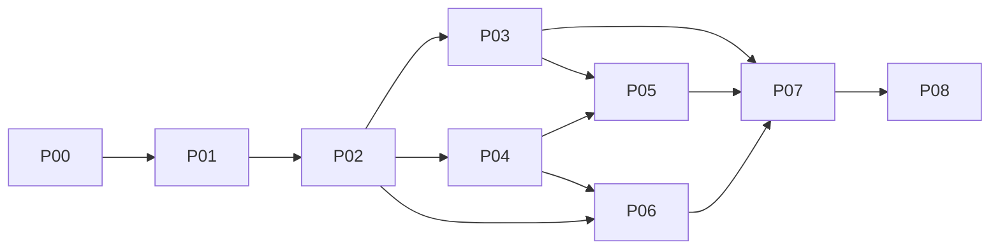

# Tools Touch 整体设计与实施索引

版本：0.2 编码交接稿 · 设计基准日：2026-09-05 · 状态：实施基线已细化，新增功能尚未编码；来源范围等未定项单独保留。

本轮目标是把现有“导师研究与邮件工作台”扩展为“学校／学院机会发现、导师研究、两级推荐和投递管理工作台”。本文是后续编码的入口；[既有实施记录](../IMPLEMENTATION.md)和[既有验收记录](../ACCEPTANCE.md)保留其历史含义，不能用本设计替代实现证据。

## 1. 阅读顺序

**新对话先读 [Luna 接手入口](START-HERE.md) 和 [实施状态](IMPLEMENTATION-STATE.md)**，再按当前工作包展开。当前首包是 P00-A；设计会话“只写文档”不限制用户后续授权的编码。

| 文档 | 回答的问题 |
| --- | --- |
| [概要设计](01-overview.md) | 系统边界、模块职责、选型、现状与目标差距 |
| [详细设计与编码约定](02-detailed-design.md) | 工程依赖、接口约定、详细文档和编码入口 |
| [固定决策、文件迁移与工作包](03-implementation-map.md) | 旧代码具体如何搬迁，37 个工作包按什么顺序落地 |
| [核心编码契约](04-contracts.md) | v2 命令／事件、事务、日期输入、发送快照、表格和导出格式 |
| [验证命令与验收矩阵](05-verification.md) | 现有／目标测试入口、20 组业务验证与证据格式 |
| [窗口黄金样例](fixtures/window-cases.json)／[评分黄金样例](fixtures/ranking-cases.json) | 合成输入和预期结果，供实际生产函数回归测试 |
| [数据模型](details/01-data-model.md) | 实体、字段、关系、索引、版本和旧数据迁移 |
| [账号、进程协议与任务](details/02-integrations-jobs.md) | Pi provider、Gmail、Python、工具、任务恢复 |
| [招生年度与窗口状态](details/03-admission-windows.md) | 往年参考、本年事实、时间边界和学校聚合 |
| [采集、证据与两级推荐](details/04-collection-recommendation.md) | 导师全量采集、学院画像、bar、推荐评分 |
| [邮件与投递记录](details/05-mail-tracking.md) | 草稿版本、用户确认、发送异常和投递状态 |
| [WPF 交互与交付](details/06-desktop-delivery.md) | 表格布局、性能、pnpm／uv、打包和验收 |
| [表格数据记录器](details/07-record-workspace.md) | 自定义表／字段、关联、保存视图、批量编辑、全量导出 |

## 2. 已确认约束与待确认选择

用户已确认：C# WPF 桌面应用；Node 相关包环境统一由 pnpm 管理；Python 相关包环境统一由 uv 管理；模型登录／研究／写作使用 Pi；发邮件前询问用户并确认；窗口必须区分本年未开始与已结束；需要学院、导师两级推荐和持久化表格记录。补充确认本地单人／单 Gmail、学校总览与校内分表、首轮 3—5 校计算机相关学院，并要求类似飞书／Notion 数据库的记录体验及全量导出。

下表分别记录用户已确认的选择和设计假设。调整选择时先修改本表及受影响文档，再修改计划。

| ID | 选择／状态 | 若不同，影响 |
| --- | --- | --- |
| Q1 | **已确认**：单人 Windows 本地工作区、单 Gmail；保存多个模型 provider 配置 | 多 Gmail 需账户切换与资料归属隔离；多人云端需独立后端、权限与同步协议 |
| Q2 | **已确认**：学校总览每校一行；校内学院／项目／批次表；Excel 每校一个工作表；支持全量导出与通用表格记录 | 数据库始终使用统一关系表；自定义表／字段与保存视图见记录器设计 |
| Q3 | **待确认**：暂按官方公开资料、公开经验网页、用户主动导入资料设计 | 登录社区自动采集需要逐来源实现登录和访问适配；首版不默认访问用户浏览器会话 |
| Q4 | **已确认**：首轮用 3—5 所学校的计算机相关学院验收，再分批扩大覆盖 | 具体学校名单在 P03 补齐；全国各学科会增加种子与指标口径 |
| A1 | `com` 暂解释为 committee：学院统一考核／导师决策权的强弱；支持混合、未知 | 如用户指其他概念，修改学院画像字段与推荐解释 |
| A2 | `bar` 是多维经验背景分布，不是单一分数；`A 会` 默认按明确版本的 CCF A 类会议口径 | 用户可指定不同会议目录、作者顺位和论文状态要求 |
| A3 | 本设计会话只形成文档；用户已说明后续新对话由 Luna 开始实现 | 后续编码按用户在新对话的授权执行；不得把这句话解释为永久禁止编码 |

Q4 的具体学校、学院名单在 P03 的种子配置中补齐。无需现在固定所有学校；数据模型不写死 C9／985／计算机。

## 3. 用户用例追踪

编号与用户列出的系统 1—11 一致。

当前逐项验收记录见 [`real-acceptance-matrix.json`](real-acceptance-matrix.json)，由 `scripts/check-acceptance-matrix.py` 校验；其中 `NotVerified` 表示已有自动／合成证据，但尚未观察到对应真实流程。

| 用例 | 模块／关键设计 | 实施步骤 |
| --- | --- | --- |
| U01 Gmail 登录 | Accounts，系统浏览器 OAuth，本地凭据 | P02、P06 |
| U02 OpenAI／DS／Claude／GLM 登录 | Pi provider 能力发现、OAuth／API Key | P02 |
| U03 导师方向分析 | Research，网页证据、论文页码、资料版本 | P04、P05 |
| U04 邮件撰写 | Pi 生成本地草稿，C# 保存修订与引用 | P06 |
| U05 用户确认发送 | Outreach，确认快照、发送状态机 | P06 |
| U06 学校／学院窗口表 | Admissions，本年与历史分离 | P03、P07 |
| U07 学院画像、背景 bar、导师评价 | Intelligence，来源声明与分组统计 | P04、P05 |
| U08 学院推荐 | Recommendation，资格过滤＋可解释评分 | P05 |
| U09 学院全部导师采集 | Faculty，目录遍历、实体合并、覆盖率 | P04 |
| U10 根据 CV／需求排名导师 | Recommendation，候选召回、批量评分、重点深读 | P05 |
| U11 分析／投递数据库及美观表格 | Records，版本快照、状态事件、自定义表／字段、关联视图及全量导出 | P01、P06、P07、P08 |

## 4. 分步实施计划

每份子计划都包含前置条件、编码位置、任务清单、验收与退出条件。全部为“计划”，没有因文档已写而标记实现完成。

每个 Pxx 进一步拆成 Pxx-A 等工作包，具体文件、先后次序和完成条件以[工作包表](03-implementation-map.md)为准；事务／协议细节以[核心契约](04-contracts.md)为准。若需要改变固定决策，先记录原因并同步文档，不能留互相矛盾的实现规范。

| 步骤 | 子计划 | 前置 | 可交付增量 |
| --- | --- | --- | --- |
| P00 | [基线、环境与工程边界](plans/P00-baseline.md) | 本设计草案 | pnpm／uv 锁定环境，旧功能回归基线 |
| P01 | [领域模型与数据迁移](plans/P01-domain-data.md) | P00 | 学校、学院、招生轮次、证据、推荐、投递模型 |
| P02 | [账号、协议与任务调度](plans/P02-accounts-jobs.md) | P01 | provider 能力界面、可恢复任务和采集协议 |
| P03 | [招生数据与窗口工作台](plans/P03-admissions.md) | P01、P02 | baoyan 导入、年度判定、学校和学院表 |
| P04 | [导师采集与研究证据](plans/P04-faculty.md) | P01、P02；使用 P03 学院目录 | 目录采集、去重、招生名额、评价、论文证据 |
| P05 | [学院画像与两级推荐](plans/P05-recommendations.md) | P03、P04 | 背景分布、学院推荐、导师排名与解释 |
| P06 | [邮件与投递闭环](plans/P06-mail-tracking.md) | P02、P04；P05 结果可选 | 研究→草稿→用户确认→发送→跟踪 |
| P07 | [表格记录器与全量导出](plans/P07-record-workspace.md) | P01；整合 P03—P06 | 自定义表／字段、关联、保存视图、批量编辑和全量导出 |
| P08 | [界面整合、性能与发布验收](plans/P08-ui-release.md) | P03—P07 | 整体 WPF 工作台、性能、恢复及 Windows 安装包 |

依赖图表示工程依赖，不是要求启用并行 agent。

建议先交付 P00—P03 的可用窗口表，再完成 P04—P06 的推荐与联系闭环，P07 完成通用表格记录器，P08 执行总体验收。P03 提前使用共用表格基础，P07 在此基础上扩展，避免重做整套页面。没有团队规模与真实来源样本前，不把人日估计当成交付承诺。

## 5. 完成判据

总体完成需要：11 个用例都有可操作入口；旧库升级保留用户资料；历史日期例子及异常边界通过；推荐可追溯到资料与来源版本；发送确认和不确定结果核对可靠；采集明确说明覆盖范围；Windows 安装包能独立运行；真实账号、模型和用户明确授权的邮件流程有独立验收记录。

后续每个步骤结束时更新子计划的状态、实际变更、执行命令、结果与证据路径。示例数据、模拟 HTTP 和真实来源验证分别记录。
