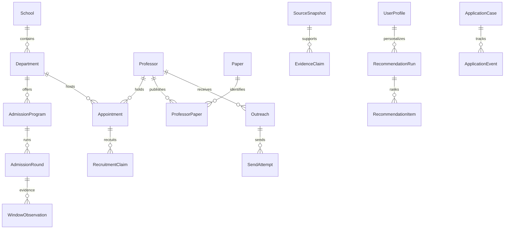

# 数据模型与迁移设计

返回[详细设计](../02-detailed-design.md)。本文描述目标模型；当前只有旧迁移 001—003，新增表将在 P01 及对应业务步骤实施。

字段与关系按本文，具体建表先后以[迁移依赖顺序](../03-implementation-map.md)为准。WorkspaceMeta／JobAttempt／ObservationOverride 等补充定义见[核心契约](../04-contracts.md)，纳入实际迁移而非仅存在于 DTO。

## 1. 存储边界

首版使用一个 SQLite 业务库，C# 是唯一业务写入方。Node 仅管理独立 Pi 认证／会话目录；Python 仅产出采集暂存文件和机器结果。原始网页、PDF、CV、长篇结果按哈希存入应用管理目录，数据库保存索引和相对路径。

所有连接启用外键；沿用 WAL，短写事务串行调度，查询使用独立连接。单实例锁覆盖同一工作区，迁移期间不启动采集或发送。模型、HTTP、文件下载在事务外执行，结果校验后用短事务发布。

## 2. 关系概览

ER 图只展示主要关系。完整的引用约束以下表为准；`UserProfile` 每行本身是一份既有资料修订。

## 3. 学校、学院和招生

通用列：ID 沿用 TEXT；CreatedAt／UpdatedAt 为 UTC；可编辑实体增加 Revision；可归档实体增加 ArchivedAt。需要保留历史的表采用追加版本，不用覆盖更新模拟历史。

| 表 | 关键字段与约束 |
| --- | --- |
| School | Id、CanonicalName、ShortName、OfficialCode?、Campus?、City?；官方代码已知时唯一，显示名称不作全球唯一键 |
| Department | Id、SchoolId FK、CanonicalName、OfficialCode?、ParentDepartmentId? FK、Kind；学院／研究院／系均可表达 |
| EntityAlias | Id、EntityKind、EntityId、Alias、SourceKey?、ValidFrom?／To?；应用校验目标存在及类型，保留曾用名 |
| ExternalIdentity | SourceKey、EntityKind、ExternalId、EntityId；前三列唯一，禁止跨源数字 ID 直接合并 |
| AdmissionProgram | Id、DepartmentId FK、Name、DegreeType、DisciplineCode?、Track?、Campus?；学硕／专硕／直博／未知分开 |
| AdmissionRound | Id、ProgramId FK、CycleYear?、EntryYear?、Kind、RoundKey、Title、OfficialUrl?、ApplicationUrl?、Revision；Kind 为 SummerCamp／PreRecommendation／Other |
| WindowObservation | Id、RoundId FK、SourceSnapshotId FK、SourceYear?、CycleYear?、EntryYear?、YearBasis、DateBasis、RegistrationStartRaw?／EndRaw?、EventStartRaw?／EndRaw?、各日期解析上下界、Precision、TimeZone、ObservedAt、SupersedesId? |
| HistoricalProjection | Id、ProgramId FK、TargetCycleYear、Kind、RoundKey、SourceObservationId FK、ProjectedStart?／End?、MethodVersion、GeneratedAt、ProjectionIssue?；唯一来源＋目标年＋算法版本 |
| EntityResolution | Id、SourceSnapshotId FK、RawSchool／Department、CandidateIdsJson、State、ResolvedBy?、ResolvedEntityId?；歧义人工处理留痕 |

招生轮次身份不能只有“学院＋年份”：同一学院有不同项目、学位、批次和补录。`RoundKey` 由来源身份或人工确认的批次标识得到；来源记录先通过 ExternalIdentity 去重，再做跨源合并。校名相同的校区、重命名院系保留映射，不凭字符串完全相等自动吞并。

DateBasis 为 Official／Aggregator／UserVerified；历史预测另存 HistoricalProjection，禁止写入真实 WindowObservation。报名开始／截止与活动开始／结束完全分开。学院不明确的校级公告落到显式“学校级招生”单位，标记 Scope=School，不能伪装成所有学院的公告。

## 4. 导师、论文、证据与学院画像

| 表 | 关键字段与约束 |
| --- | --- |
| Professor（扩展旧表） | 保留 Id、Name、Homepage、Email、Institution 等；新增 NameEn?、Orcid?、IdentityState、Revision。旧 Institution 作为待映射原文保留 |
| Appointment | Id、ProfessorId FK、DepartmentId FK、Title?、Role?、StartDate?、EndDate?、IsPrimary、EvidenceClaimId? FK；同一导师可多学院任职 |
| RecruitmentClaim | Id、AppointmentId FK、ProgramId? FK、CycleYear?、EntryYear?、DegreeType、Status、QuotaLower?／Upper?、EvidenceClaimId FK、ValidUntil?；Status=Yes／No／Unknown |
| Paper（扩展） | 保留旧 ID；DOI?、ArxivId?、Version?、Title、Venue?、PublicationState、Year?、SourceUrl、ParseStatus；不同来源通过 PaperIdentifier 映射 |
| PaperIdentifier | PaperId FK、Namespace、Value；Namespace＋Value 唯一，arXiv 版本原样保留 |
| ProfessorPaper | 保留旧联合主键；增加 AuthorshipBasis、Confidence、EvidenceClaimId?，同名作者需消歧 |
| PaperReadSegment | Id、PaperId FK、ContentHash、StartPage、EndPage、ReadScope、ExtractorVersion、TextArtifactId?；ReadScope=Abstract／Pages／FullText／Unreadable |
| SourceSnapshot | Id、SourceKey、OriginalUrl?、CanonicalUrl?、ExternalRecordId?、ContentHash、FetchedAt、PublishedAt?、SourceYear?、Transport、ArtifactId FK、ParseVersion；旧页面内容不能被新版本覆盖 |
| EvidenceClaim | Id、SnapshotId FK、SubjectKind／SubjectId、ClaimType、ValueJson、QuotedText?、LocatorJson、OriginKind、ConfidenceLabel、ValidFrom?／Until?、SupersedesId?；Subject 引用在应用层和一致性巡检校验 |
| EvidenceConflict | Id、SubjectKind／SubjectId、ClaimType、ClaimIdsJson、Resolution?、ResolvedBy?、ResolvedAt?；保留互相矛盾的来源 |
| ProfessorEvaluation | Id、ProfessorId FK、ClaimId FK、SourceType、PostedAt?、Summary、TopicsJson、VerificationState；匿名意见不直接变成导师事实标签 |
| DepartmentAssessment | Id、DepartmentId FK、ProgramId? FK、CycleYear?、CommitteeMode、ClaimIdsJson、AnalysisArtifactId?、Version；Mode=Strong／Weak／Mixed／Unknown |
| AdmissionCaseSample | Id、DepartmentId FK、ProgramId? FK、CycleYear?、RoundKind、OutcomeStage、BackgroundJson、ClaimId FK、DedupGroup、ConsentOrigin；匿名化经验样本 |
| CohortStatistic | Id、DepartmentId FK、ProgramId? FK、CycleYear、RoundKind、OutcomeStage、Metric、DefinitionVersion、Numerator?、Denominator、UnknownCount、DistributionJson、SampleIdsJson、BuiltAt |

`OriginKind` 区分 OfficialFact、ThirdPartyReport、UserNote、ModelInference。引用定位包含网页段落／表格行、PDF 页码或导入文件行号；有 URL 不等于该 URL 支持声明。用户更正通过新声明或覆盖层保存，不删除原来源。

同一 SourceSnapshot 可支撑多个声明；同一声明多来源支持时建立 `ClaimSupport(ClaimId, SnapshotId, LocatorJson)`。抓取时间与原始发表时间不得互换；网页 304 可追加 SourceCheck，不把“今天又检查过”当作“今年新公告”。

## 5. 用户、推荐和分析版本

| 表 | 关键字段与约束 |
| --- | --- |
| UserProfile（沿用） | Id、Version、CvPath、CvHash、ExperiencesJson、Confirmed、CreatedAt；扩展 StructuredFactsJson、ExtractionVersion、ConfirmedAt；每行即不可变资料版本 |
| PreferenceRevision | Id、Version、PromptText?、ParsedConstraintsJson、UserConfirmed、CreatedAt；自然语言需求与确认后的硬／软约束分开 |
| AnalysisArtifact | Id、Kind、TargetKind／TargetId、ProfileId? FK、PreferenceId? FK、AgentRunId? FK、Provider、Model、PromptVersion、EvidenceIdsJson、OutputJson、CreatedAt；业务摘要与引用，不存任意原始内部推理 |
| RecommendationRun | Id、Level、ProfileId FK、PreferenceId? FK、TargetCycleYear、AlgorithmVersion、WeightProfileJson、CandidateSnapshotArtifactId FK、DatasetRevision、AsOf、State、BudgetJson、CreatedAt |
| RecommendationItem | RunId FK、TargetKind／TargetId、Eligibility、Rank?、Score?、ScoreLower?／Upper?、ConfidenceLabel、ComponentsJson、ReasonsJson、MissingFactsJson、EvidenceIdsJson、AnalysisArtifactId? FK；同 run＋target 唯一 |
| Artifact | Id、Kind、RelativePath、ContentHash、ByteLength、MimeType、CreatedAt；引用计数由查询得出，不删除被历史记录引用的文件 |

`RecommendationItem.TargetKind` 首版仅允许 DepartmentProgram 和 ProfessorAppointment。学院展示可聚合项目，但评分原子单位是“学院内项目＋目标年度”，避免混合学硕／直博要求。导师评分原子单位带任职／学位上下文，UI 可合并显示同一人但保留具体适用范围。

评分前从一致的数据库读快照物化所有候选的特征值、声明 ID、目标年份和规则版本，再开始模型分析。引用 ID 只是辅助，输入快照还必须保存当时的实际特征，防止数据库更新后无法复现。简历变化产生新 run，旧结果显示“基于旧资料”。

## 6. 任务、邮件、投递与表格

| 表 | 关键字段与约束 |
| --- | --- |
| AgentRun（扩展为任务容器） | 沿用 Id／Kind／InputJson／State／Stage／CheckpointJson／BudgetJson；增加 ParentId?、Attempt、OwnerSession?、LeaseUntil?、NextAttemptAt?、CancelRequestedAt?、PolicyVersion |
| AgentRunEvent | 保留 RunId＋Sequence 唯一；只记录业务事件及脱敏错误 |
| JobStage | RunId、StageKey、State、InputHash、OutputArtifactId?、CheckpointJson、Attempt、StartedAt?／FinishedAt?；联合主键 |
| CrawlBatch | Id、RunId FK、ScopeJson、SourcePolicyVersion、DiscoveredCount、SucceededCount、FailedCount、SkippedCount、CoverageState、ManifestArtifactId?、PublishedAt? |
| CrawlItem | BatchId FK、CanonicalUrl／ExternalId、State、Attempt、LastError?、SnapshotId? FK；批次内源身份唯一 |
| Outreach | 保留旧表与 Draft／Sending／Sent／Failed／Unknown 状态；增加 AnalysisArtifactId?、PreferenceId?、ConfirmedSnapshotHash?；通过 CaseOutreach 关联申请，见邮件设计 |
| SendConfirmation | Id、OutreachId FK、Revision、Account、SnapshotHash、ConfirmedAt、ExpiresAt、ConsumedAt?；一次确认只能消费一次 |
| SendAttempt | Id、OutreachId FK、ConfirmationId? FK、SnapshotArtifactId FK、RfcMessageId、ProviderMessageId?、ThreadId?、State、StartedAt、FinishedAt?、ReconcileState；RfcMessageId 唯一 |
| ApplicationCase | Id、DepartmentId FK、ProgramId? FK、RoundId? FK、ProfessorId? FK、CycleYear、DegreeType、Stage、Priority、OwnerNote?、CreatedAt、Revision |
| ApplicationEvent | Id、CaseId FK、Type、PreviousStage?／NextStage?、RelatedOutreachId? FK、EvidenceArtifactId? FK、OccurredAt、RecordedAt、Note? |
| CaseOutreach | CaseId FK、OutreachId FK；联合主键，可将一次联系关联到对应申请；不另设相互冲突的 Outreach.ApplicationCaseId |
| Reminder | Id、CaseId? FK、RoundId? FK、Kind、DueAt、Basis、State；预测提醒显示预测来源 |
| 表格元数据与扩展值 | Collection、RecordRef、FieldDefinition、FieldChoice、FieldValue、RecordRelation、ViewDefinition、RecordChange；详见[表格记录器](07-record-workspace.md) |

## 7. 关键索引和约束

- `Department(SchoolId, CanonicalName)` 非唯一查询索引；`Appointment(DepartmentId, ProfessorId)`；招聘声明索引 `(AppointmentId, CycleYear, DegreeType)`。
- `AdmissionRound(ProgramId, CycleYear, Kind, RoundKey)` 对已判定年度设置有效唯一约束；未知年度通过 ExternalIdentity 去重，注意 SQLite NULL 的唯一语义。
- `WindowObservation(RoundId, ObservedAt DESC)`、`SourceSnapshot(SourceKey, ExternalRecordId, FetchedAt)`、`EvidenceClaim(SubjectKind, SubjectId, ClaimType)`。
- `RecommendationItem(RunId, Eligibility, Rank, TargetId)`；`ApplicationCase(CycleYear, Stage, DepartmentId)`；`AgentRun(State, NextAttemptAt)`。
- `SendAttempt` 对 Sending／Unknown 设置每 Outreach 最多一条未决尝试的部分唯一索引；状态用 CHECK，Revision 更新用条件 UPDATE。
- 导师 FTS 索引姓名／方向／简介；拼音列为可重建派生数据；中文子串查询作为兜底，不能假定 unicode61 自动做中文词切分。
- EvidenceClaim 的 JSON 按 ClaimType 校验 Schema；数据库 JSON CHECK 可作基础防线，引用、单位和业务条件由 C# 校验。
- 删除学校／导师默认归档，存在投递／发送／分析引用时禁止级联物理删除。来源消失标记不可访问，历史快照继续保留。

## 8. 旧库增量迁移

候选编号在实际实施时按当前最高 SchemaVersion 分配。建表按依赖分步，以下与编码交接稿的工作包一致；细节见实施映射。

| 迁移 | 内容 | 旧数据处理 |
| --- | --- | --- |
| 004 | WorkspaceMeta、学校／学院／项目／轮次、任职与外部身份 | Professor 原 ID 保持；Institution 原文转待匹配项 |
| 005 | SourceSnapshot／Artifact／EvidenceClaim／支持与冲突；WindowObservation／HistoricalProjection／Override；资料版本 | 现有 SourceDocument 转 LegacySnapshot；证据表就绪后再创建引用它的观察表 |
| 006 | JobAttempt／JobStage／CrawlBatch／CrawlItem、AgentRun 扩展 | 保留旧 Kind／状态，兼容解释或明确不可恢复原因 |
| 007 | 招生声明、论文标识与片段、评价、AnalysisArtifact | 旧研究 ID／论文阅读范围保留，不补造历史全文 |
| 008 | 学院画像、样本统计、推荐快照与分项 | 新建版本化结果，不覆盖旧研究分析 |
| 009 | 发送尝试、确认、申请记录／关系与提醒 | 旧 Sent／Unknown 原样保留；不伪造确认时间或回执 |
| 010 | 表格元数据、自定义字段、视图、更改和导入批次 | 领域值不重复存，P03 基础视图升级时保留配置 |

迁移过程：停止后台写入→通过 SQLite backup API 创建一致性备份→检验备份与附件清单→逐迁移事务→外键及完整性检查→更新应用 schema 兼容标记→启动任务。复制一个仍处于 WAL 写入中的 `.db` 文件不构成完整备份。[SQLite 在线备份文档](https://www.sqlite.org/backup.html)

迁移失败保留旧库及失败诊断；不在半迁移库启动应用。回退使用备份恢复，不直接让旧版应用打开新 schema。可再生的 FTS／拼音／缓存迁移后重建，不混入不可丢失的业务事实。

## 9. 数据验收

验证旧迁移库升级、二次启动不重复导入、事务回滚、ForeignKeyCheck、同名不同人、同人多任职、跨源 ID 冲突、来源重复抓取、人工校正保留、历史推荐可重现、旧 Unknown 不重发、自定义字段随备份恢复。测试库使用合成资料，不能拿正式 Gmail 数据作为 fixture。
