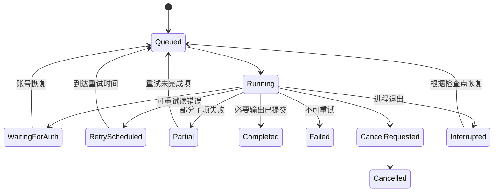

# 账号、进程协议与任务设计

返回[详细设计](../02-detailed-design.md)。应用的账号与业务任务由 C# 编排，Pi 和 Python 是能力适配器。

## 1. 账号边界

| 类型 | 认证所有者 | C#／WPF 可见信息 |
| --- | --- | --- |
| Gmail | C# GmailAuth＋WindowsSecretStore | 已授权邮箱、已授予 scopes、到期／异常状态 |
| 模型 provider | Pi ModelRuntime | provider ID、模型、支持的授权方式、已配置状态、交互事件 |
| baoyan／其他来源 | 专用来源适配器 | 匿名可用／需要来源登录／过期状态；凭据不与 Gmail 共用 |

单用户首版沿用现有 Gmail 首次登录流程，登录邮箱兼作发送邮箱。已建立工作区的凭据过期时保留资料，显示重新连接；读取缓存和恢复备份不应删除既有资料。切换 Gmail 仍是同一本地工作区中的显式重新绑定，所有历史邮件保留原 SenderAccount；不把它偷偷改成新账号。

Google 系统浏览器 OAuth 使用桌面客户端配置、随机 loopback 回调端口、PKCE S256 和 state 校验；凭据交由 Windows CurrentUser DPAPI 保存。桌面客户端配置不是可保密的服务端身份密钥。[Google 桌面 OAuth 文档](https://developers.google.com/identity/protocols/oauth2/native-app)

完整现有邮件功能沿用 `gmail.send`＋`gmail.readonly`，分别用于发送、已发送核对与回复读取；不申请永久删除权限。若日后提供“仅发送”模式，核对／回复功能必须同步降级。公开分发时 Gmail scope 类别与验证要求是交付依赖：当前官方列表把 send 列为 Sensitive，readonly 列为 Restricted。[Gmail scopes](https://developers.google.com/workspace/gmail/api/auth/scopes)

## 2. Pi provider 能力与凭据

以下只说明本地 Pi 0.85.0 源码定义；真实登录、账户计划和模型可用性仍需验收，界面每次以 Host 返回能力为准。

| UI 名称 | 本地 provider 示例 | 本地定义 |
| --- | --- | --- |
| OpenAI Codex | openai-codex | OAuth |
| OpenAI API | openai | 从 provider catalog 读取 API Key 能力，不与 Codex 账户等同 |
| Claude | anthropic | API Key＋OAuth |
| DeepSeek | deepseek | API Key |
| GLM | zai、zai-coding-cn 等实际 catalog 项 | API Key；按地区／端点区分，禁止硬编码成同一个“GLM 登录” |

依据：`pi/packages/ai/src/providers/` 和 `agent-host/src/authentication.ts`。UI 不实现任何 provider token 交换，不持久化输入的 API Key 副本；只经私有管道短暂转交 Pi 并及时清除输入控件。Pi 认证目录使用专用应用路径和当前用户访问权限；Pi 自己存储凭据不等于这些文件已受 DPAPI 加密，应在 Windows 验收检查实际存储方式。业务库与导出不包含该目录。

账户状态：Disconnected→Authorizing→Configured；凭据验证成功可另记 LastValidatedAt，Configured 不代表模型请求已成功。失败分为 Cancelled／Expired／NetworkError／Rejected／Unsupported。一次只进行一个交互授权；取消后清理回调和 prompt，并在清理完成后允许重试。

首版仍只有一个模型运行槽，研究与登录互斥；C# 排队，UI 可选择“等待当前研究结束”或取消当前研究再登录。不同任务模型配置固定在创建时；不在用户不知情时换 provider 或跨账号回退。

## 3. C# ↔ Node 协议演进

当前 ready 事件声明 `protocol_version: 1`，命令为 status／login／auth_reply／run／cancel／tool_result。保留旧命令语义，在 P02 将两侧一起升级到 protocol v2，并在握手拒绝不支持的版本；不能单独升级一侧后假定旧端支持新字段。

新 envelope 示例：

```json
{
  "protocol_version": 2,
  "type": "run",
  "id": "request-01",
  "run_id": "job-01",
  "stage_key": "faculty:local-professor-id:analyze",
  "attempt_id": "attempt-02",
  "provider": "deepseek",
  "model": "provider-catalog-model-id",
  "input_artifact_id": "artifact-01",
  "input_context": {"target_ids": ["local-professor-id"], "profile_id": "profile-01", "request": "分析方向与资料匹配"},
  "policy_id": "faculty-analysis-v1",
  "limits": {"max_tool_calls": 30, "timeout_ms": 180000}
}
```

Artifact ID 用于审计，C# 读取后将受限结构放入 input_context；Node 用固定提示模板构造任务，其余资料通过受控查询工具获取，不凭该 ID 拼本地任意路径。握手返回 host 版本、pi 版本、支持的 output schemas、provider catalog 和健康状态。request id 对应命令答复，run／stage／attempt 对应执行上下文；sequence 在 attempt 内单调递增，C# 分配业务事件序号，过期 attempt 的结果拒绝入库。

stdout 只允许协议 JSONL；stderr 是脱敏诊断。单消息初始限制 1 MiB，网页／PDF 大内容通过受控 artifact／分页工具读取；收发双方限额、超时、非法字段、未知事件处理必须一致。并发写 stdout 经串行队列，避免 JSON 行交错。任何凭据交互消息不落库、不进入诊断导出。

取消命令明确指定 run_id／attempt_id 或 auth_request_id，不继续沿用无目标全局取消。C# 只取消自己持有的活动任务，排队失败不能取消另一个任务。桥接断开后进入 Interrupted，Node 重启后由检查点恢复，不重放已提交的阶段结果。

## 4. 业务工具与结构化输出

继续使用受控 ResourceLoader，不自动发现工作区扩展、shell、任意文件读写。Pi 可以执行研究规划和多步工具调用，但所有持久化通过 C# 校验。

| 工具组 | 示例工具 | 放行范围 |
| --- | --- | --- |
| 网页与论文 | search_web、fetch_page、search_papers、read_paper | 来源访问策略、正文大小、页数与速率限制 |
| 数据查询 | search_schools、list_departments、list_professors、read_evidence | 只读分页 DTO、只返回任务需要的信息 |
| 用户资料 | read_user_profile、read_user_preferences | 仅当前任务固定的已确认版本；不返回凭据／任意文件路径 |
| 研究输出 | propose_professor、propose_evidence_claim、save_analysis | C# 验证目标身份、来源与 Schema，使用幂等键 |
| 写作 | create_outreach_draft | 仅 Draft 任务，创建本地草稿，绑定目标／资料版本 |

现有 save_professor 可作为过渡工具，但要纳入相同实体解析／证据校验。新增 collect_scope 只作为创建有预算采集任务的业务请求，不允许 Pi 无限递归触发子任务。Python 适配器也不包含第二套 LLM Agent Loop。

每个任务选出最小工具集：学院画像任务不需要 create_outreach_draft；导师分析只读取当前选定资料；通用网页内容不能申请提升工具权限。**没有 send_email、gmail_token、execute_sql、bash 或任意 write 工具。**

输出至少包含 schema_version、target_ids、evidence_ids、facts、inferences、missing_facts；模型输出需通过 JSON Schema，再检查真实 ID、引用内容、年度、单位和任务范围。最终分数与排序由 C# 规则计算。非法输出最多做一次有预算的修正请求，仍失败则保存失败原因。

## 5. Python／baoyan 集成

当前 CLI 的 JSON 导出使用中文展示字段，stdout 含人类提示，且 `--year` 仅匹配网站年份。应用不能假设它已经有稳定英文机器协议，更不能只传本年参数导致丢失历史参考。

先支持兼容导入：C# 启动指定 Python 可执行文件，`ProcessStartInfo.ArgumentList` 分参数调用，读取唯一暂存目录内的导出文件，按当前格式识别。随后增加独立 `export-machine` 或 collector host 命令，不破坏人用 CSV／XLSX 接口。

目标机器产物固定为 manifest＋records.jsonl＋raw 文件，不再采用大数组单消息。以下是 records.jsonl 的单行内容示例，封装和校验细节以[核心契约](../04-contracts.md)为准：

```json
{
  "external_id": "example-001",
  "school": "示例大学",
  "department": "计算机学院",
  "source_year": 2025,
  "kind": "PreRecommendation",
  "title": "2025 年预推免报名通知",
  "registration_start_raw": "2025-09-12",
  "registration_end_raw": "2025-09-18",
  "event_start_raw": null,
  "event_end_raw": null,
  "official_url": "https://example.edu/admission",
  "application_url": null,
  "source_url": "https://example.org/articles/example-001",
  "raw_ref": {"path": "raw/response-1.json", "json_pointer": "/content/0"}
}
```

示例是合成协议样本。raw_ref 是采集包内引用，由 C# 校验路径与哈希后映射为正式 Artifact ID，Python 不分配业务库身份。原始响应字段必须另存；不经 Excel 字符串或展示列反向推断日期。结束后校验哈希与数量，原子发布 manifest。进程退出 0、complete=true、计数一致、Schema 验证通过后才能认定该来源范围完整；空结果与抓取失败区分。

默认匿名查询，延续 CLI 总数／重复分页检查。来源需要登录时显示“来源需要登录”，不静默使用其他账号。当前 baoyan 配置使用 HTTP 源，应记 Transport=Http；不因此把聚合源提升为官方事实，官网校验由独立步骤完成。重试／登录改造以来源实际支持为准。

开发环境由 uv workspace 运行；最终安装包调用随包 Windows Python 和锁定依赖，不依赖用户安装 uv。现有 POSIX 文件权限、Chrome 路径和 shell 启动脚本需要做 Windows 适配，不能直接把 Linux `.venv` 复制进安装包。

## 6. 持久化任务状态机



取消请求先持久化，再传给对应子进程；超时后可终止该进程树。发送由独立发送状态机负责，不进入通用自动重试队列。已完成子项在父任务取消后仍保留。

阶段示例：学院采集 `DiscoverDirectory→EnumerateRoster→FetchProfiles→ExtractClaims→ResolveEntities→Publish`；研究 `Search→Read→Analyze`；推荐 `Snapshot→Eligibility→Recall→Score→Explain→Publish`。子任务键包含批次、目标与阶段；Output＋Stage 完成＋必要事件在同一事务提交。

任务采用短期 lease＋工作区进程会话 ID。启动时检查当前工作区单实例和旧会话，收回失效 lease；同一幂等键已提交则直接取旧结果。重复工具响应、迟到的旧进程结果和重复点击不会重复建导师或覆盖人工草稿。

初始调度策略：模型并发 1；公开网页总并发 4、每域名 1；尊重各来源更严格限制。既有 arXiv／Crossref 限速器继续复用，配置按提供方返回要求可调。HTTP 读 max_attempts=3（首次＋最多两次重试），指数退避加抖动并尊重 Retry-After；结构变化、无授权和验证码进入待处理，不高频重试。

预算包括最大目标数、页面数、单页字节数、工具次数、模型请求数、token 估计、运行时间和可用时的费用估计。批量任务使用作业总预算＋单目标预算，不能以拆子任务规避总预算。费用未知显示未知；缓存键包含来源内容哈希、模型、提示版本和资料版本。

任务仅在应用运行时调度。关闭应用后记录中断，下次启动恢复；首版不承诺关机期间爬取或提醒。

## 7. 验收重点

验证真实子进程握手、版本不匹配、同一账号重复登录／取消、丢失回调、配置但无模型权限、非法工具、过期 attempt 结果、半份 CLI 输出、重复分页、任务恢复与原子阶段提交。真实模型与账号流程另列人工验收，不通过读取 catalog 宣称已登录成功。
