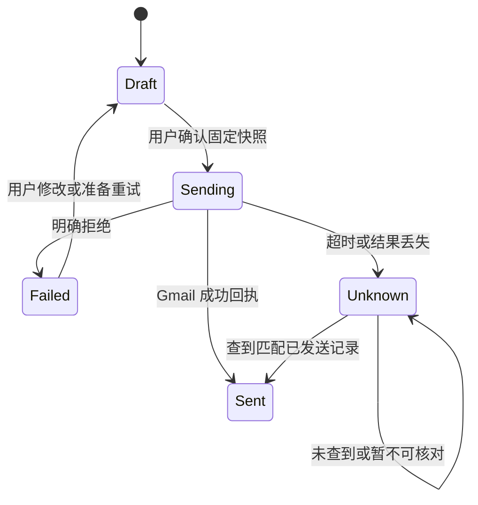

# 邮件、用户确认与投递记录

返回[详细设计](../02-detailed-design.md)。延续已有 OutreachService／GmailService 的发送边界，并把“导师联系”和“学校官网申请”分别记录、相互关联。

## 1. 邮件起草与版本

DraftRequest 固定 ProfessorId、AppointmentId?、ProfileId、PreferenceId?、AnalysisArtifactId、语言和写作需求。Pi 的写作输出只能创建本地草稿，不能同步／发送 Gmail。

同一任务恢复使用稳定幂等键，返回既有草稿；用户点“重新生成”创建新 Version。人工修改增加 Revision，保留更改记录。草稿引用导师与用户事实的来源，保存编写时模型／提示版本；不得在 CV 中补造论文、成绩或经历。

收件人必须来自公开来源或用户明确填写。缺少邮件地址时可保存草稿，发送按钮解释缺失项。联系邮件与官网的 sign_up_email 是不同用途，不自动互换。

## 2. 确认快照

用户点击发送先生成 SendPreview，完整展示发件邮箱、To／Cc／Bcc（未支持时为空）、主题、正文、附件文件名／大小、导师与关联申请。用户在 WPF 明确点击“确认发送”后，C# 才发起传输。

发送快照包含：草稿 Id／Version／Revision、SenderAccount、收件人集合、主题／正文、附件内容哈希、资料版本、快照哈希和固定 RfcMessageId。确认后编辑正文、改收件人、换附件或换 Gmail 都使旧确认失效；确认绑定内容，不绑定一个可继续变化的草稿指针。

`SendConfirmation` 由应用交互流程创建，为一次性记录，默认有效 15 分钟；同一事务内检查未消费／未过期及 snapshot hash，再消费确认、创建 SendAttempt、将 Outreach 改成 Sending。模型工具不能获得或提交确认令牌。双击与重复事件只允许一个未决发送尝试。

## 3. 发送状态机

Gmail API 的发送成功响应包含 Message；请求不含应用级通用幂等键。应用不能承诺网络异常下的远端 exactly-once，需用本地未决状态和核对降低重复发送。[Gmail users.messages.send](https://developers.google.com/workspace/gmail/api/reference/rest/v1/users.messages/send)

| 情况 | 行为 |
| --- | --- |
| 准备阶段资料／附件哈希不符 | 保留 Draft，要求重新预览确认 |
| 明确授权／收件格式等拒绝 | Failed，记录可理解错误；再发需要新确认 |
| 请求已开始后超时、5xx、连接中断、无法解析回执 | Unknown，阻止自动重发 |
| 用户在网络请求发出后取消 | 无法证明未发送时仍为 Unknown，不标为已撤回 |
| 应用重启发现 Sending | 恢复成 Unknown，等待核对 |
| Unknown 在已发送中没有找到 | 继续 Unknown；“未找到”不是“未发出”的证明 |

发送错误分类使用 Gmail 响应语义和“请求是否可能已到达”判断，沿用现有测试并补充边界。邮件请求绝不走通用 HTTP 自动重试策略。

## 4. 不确定结果核对与回复

核对使用原 SenderAccount、固定 RFC Message-ID、收件人、时间范围及 SENT 标签；必要时再比对主题／正文摘要，记录 ProviderMessageId 与 ThreadId。跨账号登录时不能在新账号的 Sent 中核对旧账号发送。已确认成功后不可再次发送同一尝试。

首版 Unknown 只能核对或由用户记录“已在 Gmail 人工核验”的结论及依据。若用户仍要再次联系，创建独立新草稿、展示旧 Unknown 记录，再由用户明确确认；不通过改表格状态释放原尝试的发送锁。

回复按账号＋threadId 关联，排除本账号发出消息；补充检查 In-Reply-To／References，跨线程未确定匹配进入待关联队列。NoReply 仅表示截至 SyncedAt 未发现关联回复。AI 可提出“收到积极回复／需补材料”建议，但更新正式申请阶段要由用户确认。

## 5. 申请记录与联系记录

ApplicationCase 表示某申请年度的一项学院／项目／轮次申请，可关联一个或多个导师联系记录。首版固定使用 `CaseOutreach(CaseId, OutreachId)` 关系，不在 Outreach 再维护一份 ApplicationCaseId，不复制草稿。

申请 Stage 建议为 Interested／Preparing／Submitted／Interview／Waitlisted／Offer／Rejected／Withdrawn／Archived；阶段可以由用户修正，所有转换追加 ApplicationEvent，不凭邮件已发自动设成 Submitted。用户在官网投递后登记提交时间、报名编号、材料清单和回执附件。

联系状态由邮件派生：未联系、草稿中、发送中、已发送、结果待核对、已回复；用户自定义的“拟再次联系”“电话沟通”等作为独立字段／事件。申请状态、联系状态、窗口状态在表格中分列。

字段包括学校、学院、项目、导师、申请年度、窗口／截止、优先级、材料、报名链接、提交时间、最近联系、回复、下一步、提醒、备注；支持[表格记录器](07-record-workspace.md)的自定义字段和关联视图。

## 6. 审计与导出

保存实际发送快照和回执，草稿重生成不修改历史已发内容。导出包含业务记录、草稿版本、发送结果和关联申请；不包含 Gmail／Pi token。用户隐藏列不代表该字段从数据库删除，全量导出范围有明确预览。

批量编辑可以修改备注／优先级等普通字段；发送只能逐封预览确认。批量选择“生成草稿”创建多个受预算控制的 Draft 任务，不赋予发送授权。

## 7. 验收用例

保留现有重复点击、附件变更、旧资料、异常网络、重启恢复与 Gmail MIME 测试；新增一次性确认消费、过期确认、跨账号核对、确认后表格编辑、导入旧 Sent 不触发发送、申请状态不受发送结果隐式覆盖、回复跨线程歧义。自动化测试只用替身；真实发送验收必须由用户对具体邮件明确确认。
